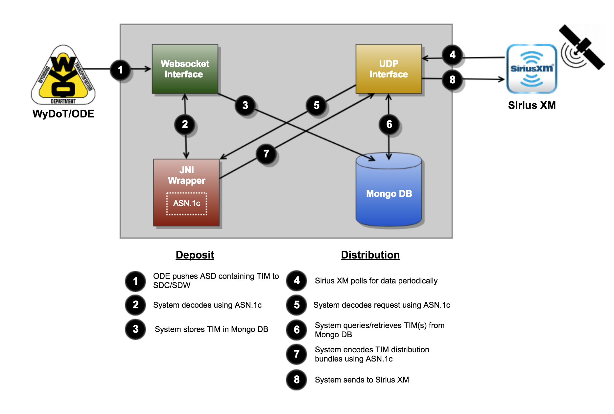

# jpo-sdcsdw
US Department of Transportation Joint Program office (JPO) Situational Data Clearinghouse/Situational Data Warehouse (SDC/SDW)

In the context of ITS, the Situation Data Warehouse is a software system that
allows users to deposit situational data for use with connected vehicles (CV) and
later query for that data.



<a name="toc"/>

## Table of Contents

[I. Release Notes](#release-notes)

[II. Documentation](#documentation)

[III. Collaboration Tools](#collaboration-tools)

[IV. Getting Started](#getting-started)

---

<a name="release-notes"/>

## [I. Release Notes](ReleaseNotes.md)

<a name="documentation"/>

## II. Documentation

<a name="collaboration-tools"/>

## III. Collaboration Tools

### Source Repositories - GitHub

* Main repository on GitHub (public)
    * https://github.com/usdot-jpo-sdcsdw/jpo-sdcsdw
    * git@github.com:usdot-jpo-sdcsdw/jpo-sdcsdw.git

### Agile Project Managment - Jira

https://usdotjposdcsdw.atlassian.net/secure/RapidBoard.jspa?rapidView=1&projectKey=SDCSDW

### Wiki - Confluence

https://usdotjposdcsdw.atlassian.net/wiki/spaces/SDCSDW/overview

### Continuous Integration and Delivery

TODO

### Static Code Analysis

TODO

<a name="getting-started"/>

## IV. Getting Started

The following instructions describe the procedure to fetch, build, and run the application.

### Prerequisites

* JDK 1.8: http://www.oracle.com/technetwork/pt/java/javase/downloads/jdk8-downloads-2133151.html
* Maven: https://maven.apache.org/install.html
* Git: https://git-scm.com/
* Docker: https://www.docker.com/get-docker
* Make: https://www.gnu.org/software/make/
* Autotools: https://www.gnu.org/software/automake/manual/html_node/index.html#Top
* Clang: https://clang.llvm.org/ (MacOS, Linux)
* GCC: http://gcc.gnu.org/ (Windows)
* Docker: https://www.docker.com/get-started
    * Optional if building on MacOS or Linux and not planning on deploying the system in Docker

---

### Obtain the Source Code

|Name|Description|
|----|-----------|
|[common-models](https://github.com/usdot-jpo-sdcsdw/common-models)|Models containing traveler information|
|[per-xer-codec](https://github.com/usdot-jpo-sdcsdw/per-xer-codec)|JNI Wrapper around asn1c-generated code|
|[udp-interface](https://github.com/usdot-jpo-sdcsdw/udp-interface)|Interface for querying traveler information over UDP using the SEMI extensions protocol|
|[fedgov-cv-webapp-websocket](https://github.com/usdot-jpo-sdcsdw/fedgov-cv-webapp-websocket)|Interface for depositing and querying for traveler information over Websockets|
|[fedgov-cv-whtools-webapp](https://github.com/usdot-jpo-sdcsdw/fedgov-cv-whtools-webapp)|Web GUI front-end for the websockets interface|
|[fedgov-cv-sso-webapp](https://github.com/usdot-jpo-sdcsdw/fedgov-cv-sso-webapp)|Central Authentication Server for securing the Web GUI and Websockets back-end|
|[credentials-db](https://github.com/usdot-jpo-sdcsdw/credentials-db)|Docker image for storing user credentials|
|[fedgov-cv-message-validator-webapp](https://github.com/usdot-jpo-sdcsdw/fedgov-cv-message-validator-webapp)|Web GUI for validating messages to be deposited|
|[tim-db](https://github.com/usdot-jpo-sdcsdw/tim-db)|Docker image for storing traveler information|


#### Step 1 - Clone public repository

Clone the source code from the GitHub Repository using Git Command:

```bash
git clone --recurse-submodules https://github.com/usdot-jpo-sdcsdw/jpo-sdcsdw
```

Note: Make sure you specify the --recurse-submodules option on the clone command line. This option will cause the cloning of all dependent submodules:

### Build the Application

NOTE: Due to [limitations in Windows](https://support.microsoft.com/en-us/help/830473/command-prompt-cmd-exe-command-line-string-limitation),
the system cannot be built normally on Windows, and cannot run on Windows. See
the section on "build.with.docker" for an explanation the impact on the build
process, and how to build non-Windows versions of system while still on Windows.

#### Build Process

The SDC/SDW uses Maven to manage builds

**Step 1**: Add ASN.1 Specification files

For more information on this process, please see the documenation for the [PER XER Codec](per-xer-codec/README.md)

```bash
cp ... per-xer-codec/asn1-codegen/src/asn1/
```

**Step 2**: Build using maven

```bash
mvn install [-Dparameter=value]...
```

##### Required Build Parameters

When building, you will need to provide the urls that the artifacts will be deployed at. The three URLs you will need to provide are:

###### cas.server.login.url

```bash
-Dcas.server.login.url=https://my.cas.com/login
```

The login url for the CAS, e.g. https://my.cas.com/login

###### cas.server.prefix.url

```bash
-Dcas.server.prefix.url=https://my.cas.com/
```

The url prefix for the CAS, e.g. https://my.cas.com/

###### whtools.server.prefix.url

```bash
-Dwhtools.server.prefix.url=https://my.whtools.com/
```

The url prefix for the Warehouse Tools Server, e.g. https://my.whtools.com/

##### Optional Build Parameters

In addition to providing properties to specify these three URLs, additional properties can be provided to control the build process:

###### build.with.docker

```bash
-Dbuild.with.docker=true
-Dbuild.with.docker=cygwin
```

Set this property to any string to enable building the artifacts (as well as
generate and build the ASN.1 codec) within a docker container. This requires
a running docker daemon as well as an install docker client configured to use
that daemon.

On windows, if you are running under a linux-like shell, such as cygwin, mingw,
git-bash, etc, set this property to "cygwin", otherwise you will experience odd
errors.

Note that unless are you running under a linux OS, the produced ASN.1 codec
binary will not be usable on your local system, and will only be runnable under
linux or another docker container.

**NOTE**: Due to the command length limitation of the windows command shell, it is
currently impossible to build the system natively on windows. You must use this
property if you are building the system on a non-posix system. This also means
that unit tests will be unable to execute during the build, to prevent this from
failing the build, add the `-Dmaven.test.skip=true` argument.

###### cygwin.install.root

```bash
-Dcygwin.install.root=C:\Path\To\Cygwin\
```

When building on windows using cygwin/mingw/git-bash, etc, by default, the build
system assumes your installation root is `C:\Program Files\Git`. Set this
property to specify a different root path.


###### per-xer-codec.skipAutogen

```bash
-Dper-xer-codec.skipAutogen=true
```

Set this property to "true" to skip re-generating the ASN.1 codec C code. If you'
have not already generated this code, this will cause the build to fail with
unexpected error messages.

###### sdcsdw.skipDocker

```bash
-Dsdcsdw.skipDocker=true
```

By default, the build system will build the five docker images for the system.
If you do not have a docker daemon accessible, or simply wish to skip this step,
set this property to "true".

Note that the docker images require a linux binary artifact from the
per-xer-codec, if you are building on Windows or MacOS in a non-docker mode,
this will cause the build to fail if you have not previously built this
artifact.

###### sdcsdw.docker.repository

```bash
-Dsdcsdw.docker.repository=my-custom-docker-repo.com:8080/
```

This property allows you to add a prefix to the docker image repository, for
example, to specify a remote URL (such as Amazon ECR). By default, this
property is blank, meaning that the image will be restricted to daemon it is
built on.

###### sdcsdw.docker.tag
```bash
-Dsdcsdw.docker.tag=1.2.3-SNAPSHOT
```

Set this property to specify the tag of the docker images. By default, this is
set to "testing" to prevent accidental overwriting or collision.

See the README's for each sub-project for information on configuring specific images.

##### Note for building docker containers behind a HTTP proxy

If you are building the system's docker containers while having your HTTP_PROXY
and related variables set, you may encounter an error similar to the following:

```bash
Jan 28, 2019 1:27:26 PM com.spotify.docker.client.shaded.org.apache.http.impl.execchain.RetryExec execute
INFO: I/O exception (com.spotify.docker.client.shaded.org.apache.http.NoHttpResponseException) caught when processing request to {}->http://proxy-east.aero.org:8080->unix://localhost:80: The target server failed to respond
```

To solve this, add the `-Ddockerfile.useProxy=false` argument.

### Deploy the Application

From here, please follow the [deployment guide](https://usdotjposdcsdw.atlassian.net/wiki/spaces/SDCSDW/pages/34340865/AWS+Bootstrap+Deployment) on the wiki
